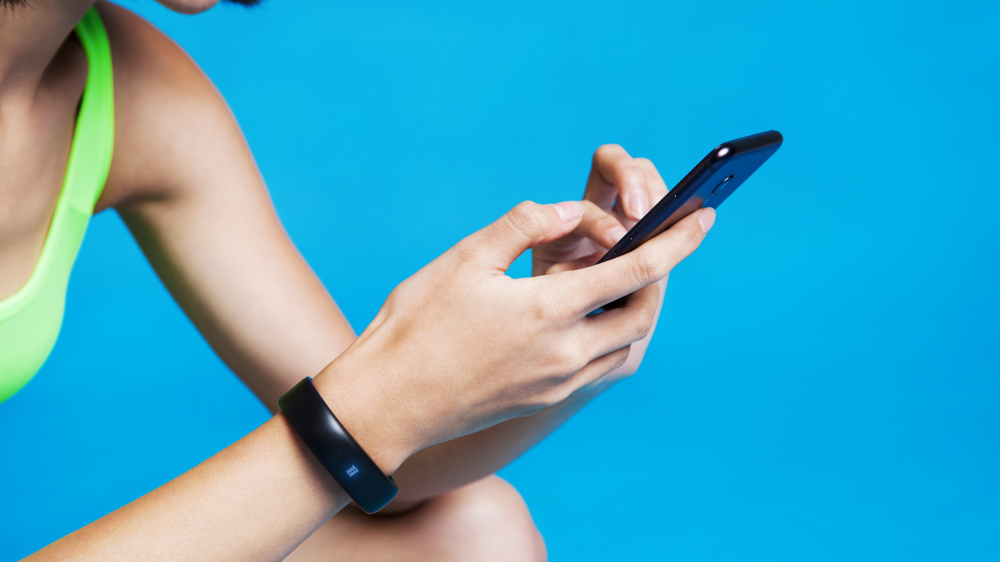

# Meizu H1 BLE Tools



Small Python utilities for discovering and controlling the Meizu H1 fitness band over Bluetooth Low Energy (BLE). The command interface is based on the text protocol found in the Meizu Band Android app (version 1.0.24).

## Features

- Scan for nearby BLE devices.
- Synchronize the band clock and timezone.
- Configure wrist-lift screen activation, alarms, and SMS-style notifications.
- Inspect GATT services and characteristics and save a diagnostic report.

## Requirements

Python 3.10+ and [Bleak](https://bleak.readthedocs.io/):

```sh
python3 -m pip install bleak
```

## Usage

Scan for the band, then use the address reported by the scan command:

```sh
python3 meizu_band.py scan
python3 meizu_band.py set_time <DEVICE_ADDRESS>
python3 meizu_band.py set_handup <DEVICE_ADDRESS> --start 07:00 --end 23:00
python3 meizu_band.py notify <DEVICE_ADDRESS> "Test message"
python3 meizu_band.py set_alarm <DEVICE_ADDRESS> 07:30 --repeat weekdays
python3 meizu_band.py inspect <DEVICE_ADDRESS> --output meizu_report.json
```

Replace `<DEVICE_ADDRESS>` with the address shown by `scan`. The band must be nearby and available for a BLE connection. See [MEIZU_H1_PROTOCOL.md](MEIZU_H1_PROTOCOL.md) for command details and protocol findings.

## Privacy

Do not publish device addresses, serial numbers, personal notification text, or unredacted diagnostic reports. The sample reports in this repository have been anonymized.

## Image credit

Product image: [Meizu Band in use](https://www.techradar.com/news/meizu-band-offers-fitbit-rivaling-features-at-pocket-money-prices).
